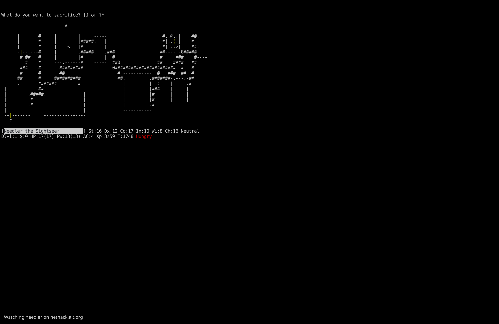

# NH Watcher

A macOS screensaver that displays live [NetHack](https://nethack.org/) games from [nethack.alt.org](https://alt.org/nethack/) or [hardfought.org](https://www.hardfought.org/).

It connects via SSH to a dgamelaunch server, picks a random active game that fits your screen, and renders the terminal output in a fullscreen window. When a game goes idle or ends, it automatically switches to another. If no live games are available, it plays back recorded games (ttyrec files) from the NAO archive.



## Installation

### As a screensaver

```bash
make install
```

Then open **System Settings > Screen Saver** and select **NH Watcher**.

### As a standalone app

```bash
make run
```

## Controls (standalone mode)

| Key | Action |
|-----|--------|
| **S** | Switch to a different game |
| **Q** / **Escape** | Quit |

In screensaver mode, any keypress or mouse movement exits.

## Building from source

Requires Go and Xcode command line tools.

```bash
# Build the .saver bundle
make saver

# Build just the Go binary
make app

# Run tests
go test ./internal/nao/

# Uninstall the screensaver
make uninstall
```

## How it works

1. Connects via SSH to `nethack@alt.org` or one of the `hardfought.org` servers (no credentials needed)
2. Navigates the dgamelaunch watch menu
3. Parses the game list, filters to non-idle games that fit the terminal
4. Selects one at random and streams the live terminal output
5. Switches games after 2 minutes of inactivity or when the watched game ends
6. Falls back to ttyrec playback when no live games are available

## License

[MIT](LICENSE)
